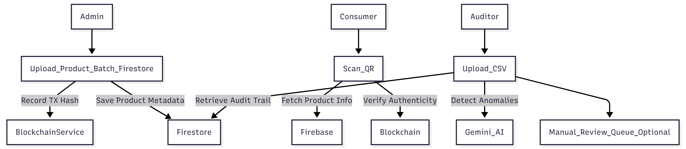

# Chronos Ledger: Blockchain-Backed Pharma Supply Chain Integrity System

Chronos Ledger is a decentralized application (dApp) designed to combat pharmaceutical counterfeiting and ensure complete supply chain transparency from manufacturer to consumer. By leveraging **blockchain's immutability** and **AI-driven anomaly detection**, Chronos Ledger establishes an unbreachable record of authenticity for every medicine batch.

---

## Idea & Value Proposition

The core idea is to link every batch of medicine to a **unique, verifiable cryptographic hash registered on a public ledger**. This makes every step of the product's journey — from initial production to final sale — auditable and tamper-proof. If a product's hash is not on-chain or the chain of custody is broken, it signals a potential counterfeit or data breach.

* **Transparency:** Every transaction is verifiable by stakeholders.
* **Authenticity:** Immediate verification of product genuineness via QR scan.
* **Traceability:** A permanent, immutable record of the product's lineage.

---

## System Structure & Roles

Chronos Ledger defines three primary roles, each interacting with the system to fulfill specific security and verification functions:

| Role | Primary Functions | Key Interaction |
| :--- | :--- | :--- |
| **Admin / Manufacturer** | Uploads product batch details and metadata. Registers the unique cryptographic hash on the blockchain via the Smart Contract. | Frontend Interface & Ethers.js |
| **Consumer / Retailer** | Scans product QR codes to instantly verify authenticity. Checks the product's hash against the on-chain record. | Frontend via QR Processing |
| **Auditor / Regulator** | Runs AI-assisted checks on data trends. Verifies the consistency between immutable on-chain hashes and off-chain metadata. | AI Integration (Gemini API) & Database |

---

## Tech Stack

Chronos Ledger is built using a modern, reliable, and secure technology stack across different layers:

| Layer | Technology | Purpose / Justification |
| :--- | :--- | :--- |
| **Frontend** | React + TypeScript + TailwindCSS | Provides a responsive, type-safe, and reliable user interface. |
| **Blockchain** | Ethereum (Sepolia Testnet) + Ethers.js | Offers a transparent, decentralized, and immutable ledger for product registration. |
| **Smart Contract** | Solidity | Defines the core logic for registering, verifying, and managing product hashes on-chain. |
| **Database** | Firebase Firestore | Stores product metadata, links, and necessary off-chain details with secure cloud access. |
| **AI Integration** | Gemini API | Powers the **AI anomaly detection** engine, identifying inconsistencies or irregular data trends for auditing. |
| **QR Processing** | jsQR (planned) | Enables fast, reliable scanning of product codes to initiate the blockchain verification flow. |

---

##  Core Workflow

The system's integrity relies on a three-step verification process:

1.  **Product Registration:**
    > Admin uploads product details $\rightarrow$ Unique hash is generated $\rightarrow$ Hash is registered on the **Solidity Smart Contract** (on-chain).
2.  **Product Verification:**
    > Consumer scans product QR code $\rightarrow$ Frontend queries the blockchain (via Ethers.js) for the registered hash $\rightarrow$ Product authenticity is verified instantly.
3.  **System Auditing:**
    > Auditor initiates an audit $\rightarrow$ **Gemini API** checks data consistency across Firestore (metadata) and the blockchain (hashes) $\rightarrow$ Anomalies or inconsistencies are flagged and reported.

All non-verification-critical interactions are logged in **Firestore**, while the core trust validation and ownership chain remain on the **Ethereum blockchain**.


---

## Run Locally

**Prerequisites:**  

* Node.js ≥ 18

* npm ≥ 9

## Setup Instructions

```bash
# Clone the repository
git clone https://github.com/ANewShaman/ChronosLedger.git
cd ChronosLedger

# Install dependencies
npm install

# Set up environment variables
# Open .env.local and add your Gemini API key like this:
# GEMINI_API_KEY=your_api_key_here

# Run the app
npm run dev
```

## Important Notes!

-Wallet connection is required for both Admin and Audit roles.

-The system currently runs on the Sepolia test network.

-Admin Access: Any wallet address can register and manage product batches.

-Audit Access: Restricted to a single authorized wallet (developer wallet).

-Gas Fees: Ensure your connected wallet has enough Sepolia ETH to cover contract interactions.

-You can obtain test ETH from the Sepolia Faucet
 before interacting where it's needed.
